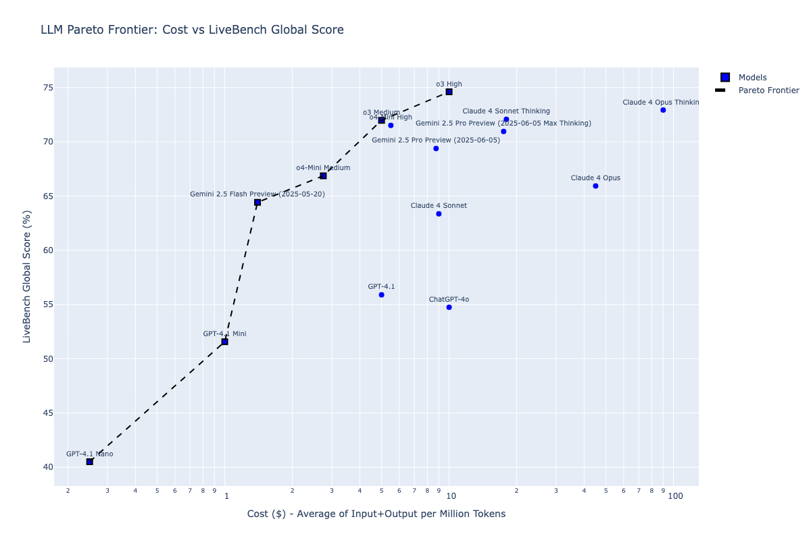
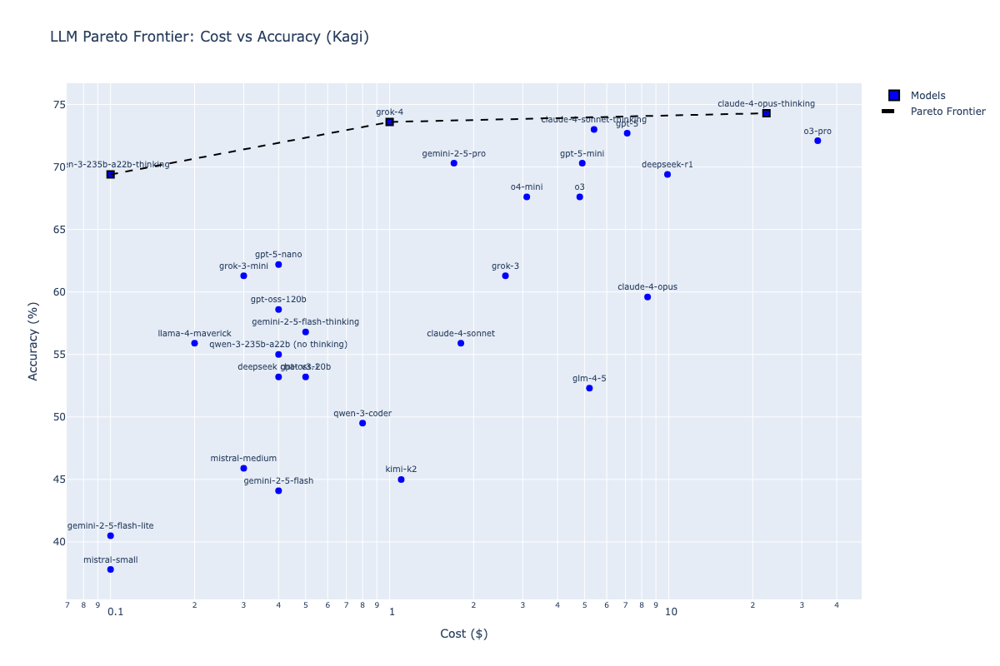
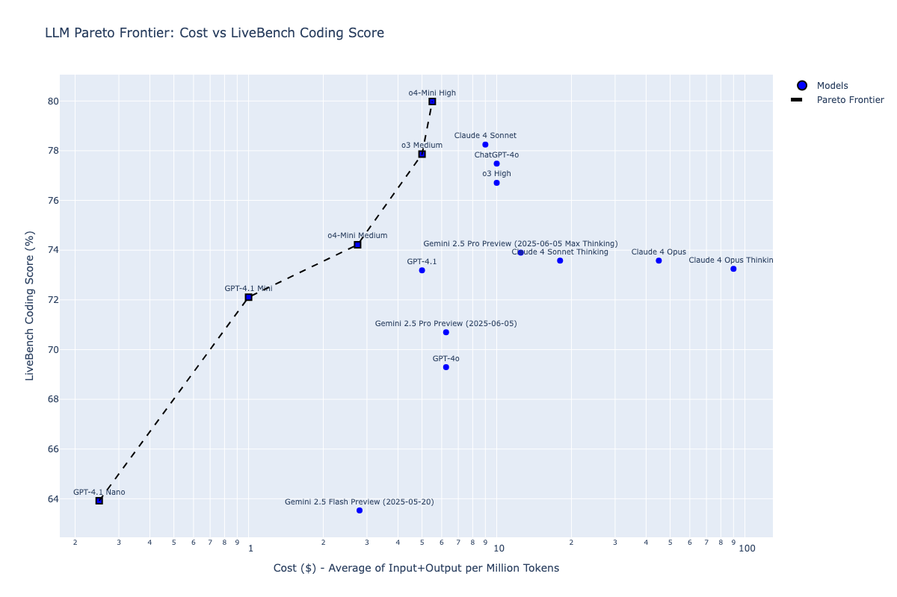
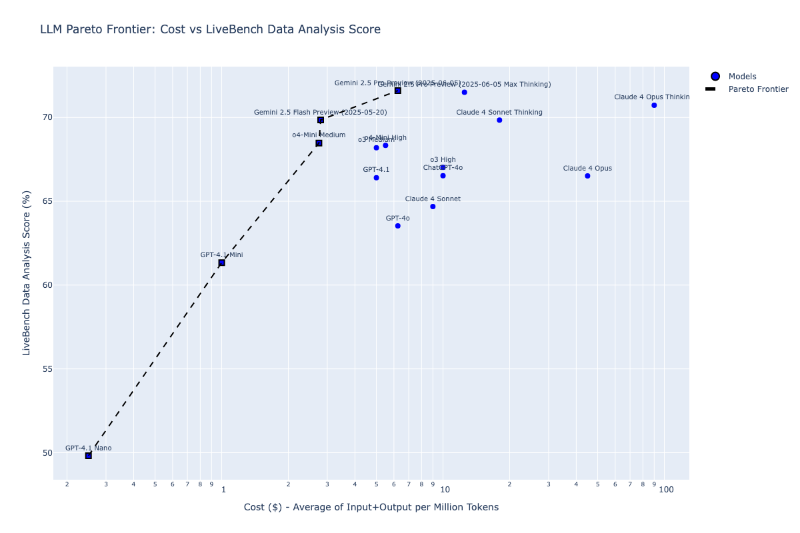
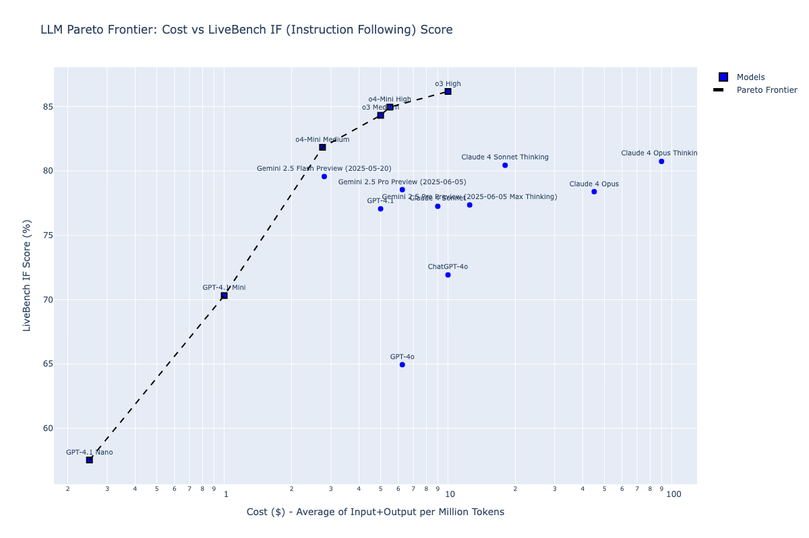
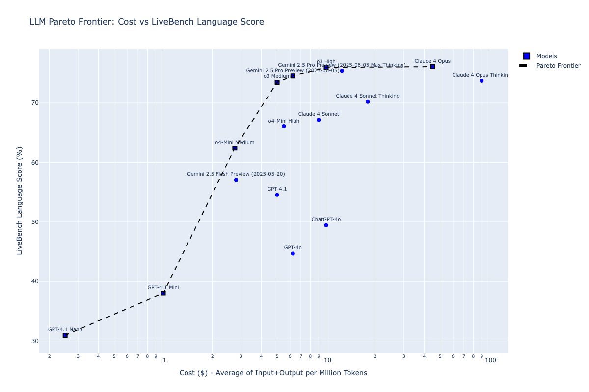
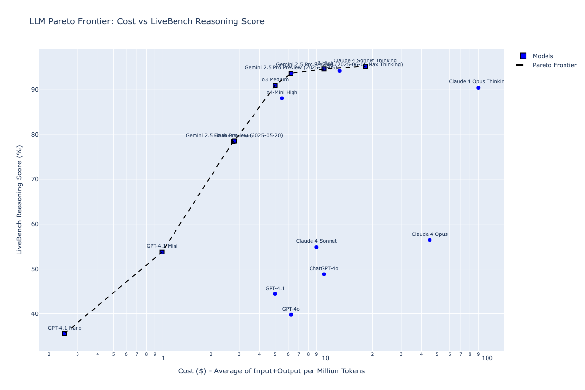
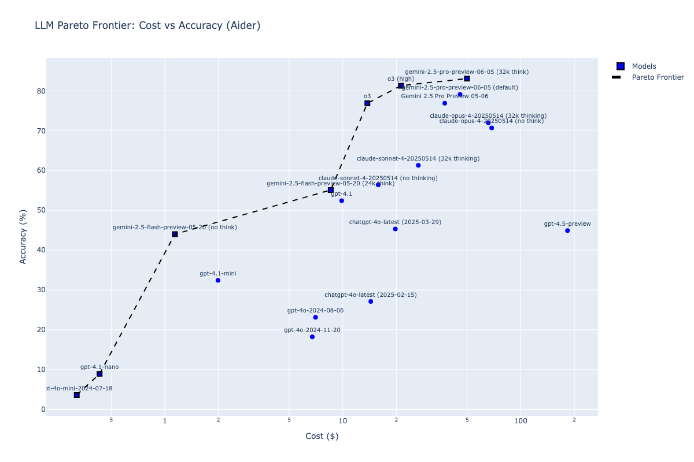

# LLM Pareto Frontier Analysis

This repository contains code for analyzing and visualizing the Pareto frontier of Large Language Models (LLMs) based on their cost-accuracy trade-offs.

## What is this?

The scripts in this repository create scatter plots that help identify which LLMs offer the best value proposition by plotting accuracy against cost. The **Pareto frontier** represents the set of models that are not dominated by any other model - meaning no other model offers both lower cost AND higher accuracy.

## Scripts

### pareto-livebench.py
Creates a Pareto frontier visualization using data from the LiveBench LLM benchmark.

### pareto-kagi.py
Creates a Pareto frontier visualization using data from the Kagi LLM benchmark.

### pareto-livebench-coding.py
Creates a Pareto frontier visualization using LiveBench coding-specific performance data.

### pareto-livebench-data-analysis.py
Creates a Pareto frontier visualization using LiveBench data analysis performance data.

### pareto-livebench-if.py
Creates a Pareto frontier visualization using LiveBench instruction following performance data.

### pareto-livebench-language.py
Creates a Pareto frontier visualization using LiveBench language task performance data.

### pareto-livebench-reasoning.py
Creates a Pareto frontier visualization using LiveBench reasoning performance data.

### pareto-aider.py  
Creates a Pareto frontier visualization using data from Aider's LLM benchmark.

## Related Blog Posts

- [Pareto frontier LLMs, Aider edition](https://samek.fyi/pareto-frontier-llms-aider-edition/)
- [Pareto frontier LLMs, Kagi edition](https://samek.fyi/pareto-frontier-models-kagi-edition/)
