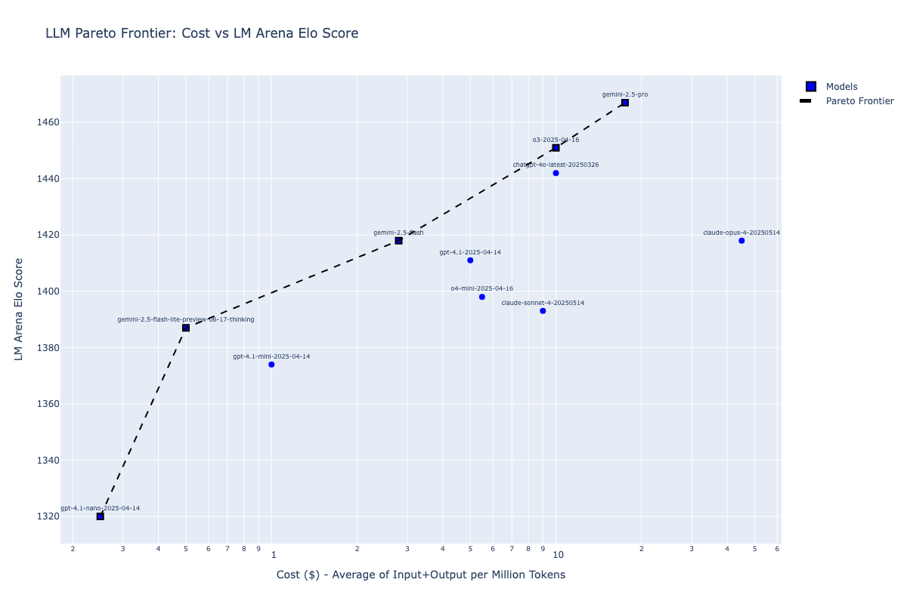

# LLM Pareto Frontier Analysis

This repository contains code for analyzing and visualizing the Pareto frontier of Large Language Models (LLMs) based on their cost-accuracy trade-offs.

## What is this?

The scripts in this repository create scatter plots that help identify which LLMs offer the best value proposition by plotting accuracy against cost. The **Pareto frontier** represents the set of models that are not dominated by any other model - meaning no other model offers both lower cost AND higher accuracy.

## Scripts

### Aider

[Aider](https://aider.chat/docs/leaderboards/)

#### pareto-aider.py

### Kagi

[Kagi](https://help.kagi.com/kagi/ai/llm-benchmark.html)

#### pareto-kagi.py

### LM Arena

[LM Arena](https://lmarena.ai/)

#### pareto-lmarena.py

### LiveBench

[LiveBench](https://livebench.ai/)

#### pareto-livebench.py

### SimpleBench

[SimpleBench](https://simple-bench.com/)

#### pareto-simplebench.py

## Related Blog Posts

- [Pareto frontier LLMs, Aider edition](https://samek.fyi/pareto-frontier-llms-aider-edition/)
- [Pareto frontier LLMs, Kagi edition](https://samek.fyi/pareto-frontier-models-kagi-edition/)
