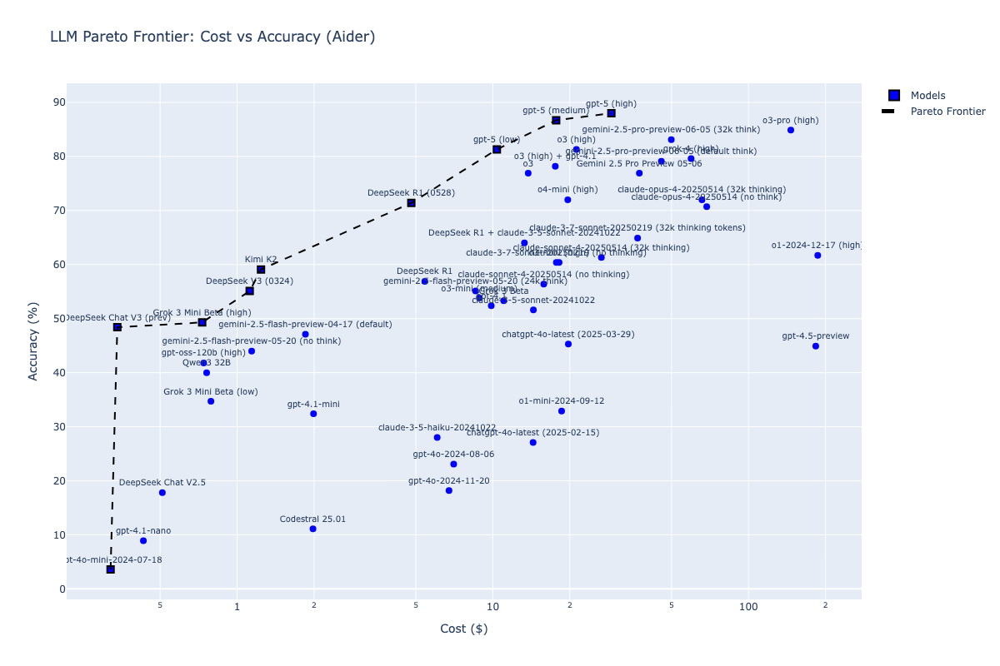

# LLM Pareto Frontier Analysis

This repository contains code for analyzing and visualizing the Pareto frontier of Large Language Models (LLMs) based on their cost-accuracy trade-offs.

## What is this?

The scripts in this repository create scatter plots that help identify which LLMs offer the best value proposition by plotting accuracy against cost. The **Pareto frontier** represents the set of models that are not dominated by any other model - meaning no other model offers both lower cost AND higher accuracy.

## Why does this matter?

When choosing an LLM for a project, you typically face a trade-off between:
- **Accuracy**: How well the model performs on your tasks
- **Cost**: How much you pay per API call or token

Understanding the Pareto frontier helps you:
1. **Identify efficient models**: Models on the frontier offer the best accuracy for their cost tier
2. **Avoid dominated models**: Models not on the frontier are strictly worse than alternatives
3. **Make informed decisions**: Choose the right model based on your budget and accuracy requirements

## Scripts

### pareto-livebench.py
Creates a Pareto frontier visualization using data from the LiveBench LLM benchmark. This script:
- Shows the trade-off between cost and overall LiveBench performance
- Highlights Pareto-optimal models with square markers
- Uses a logarithmic cost scale to handle the wide range of model costs

### pareto-kagi.py
Creates a Pareto frontier visualization using data from the Kagi LLM benchmark. This script:
- Color-codes models by whether they use Chain-of-Thought (CoT) reasoning
- Highlights Pareto-optimal models with squares and bold labels
- Uses a logarithmic cost scale to handle the wide range of model costs

### pareto-aider.py  
Creates a Pareto frontier visualization using data from Aider's LLM benchmark. This script:
- Focuses on coding-specific performance metrics
- Uses consistent blue coloring for all models
- Emphasizes the frontier models with distinctive markers

## Related Blog Posts

- [Pareto frontier LLMs, Aider edition](https://samek.fyi/pareto-frontier-llms-aider-edition/)
- [Pareto frontier LLMs, Kagi edition](https://samek.fyi/pareto-frontier-models-kagi-edition/)
